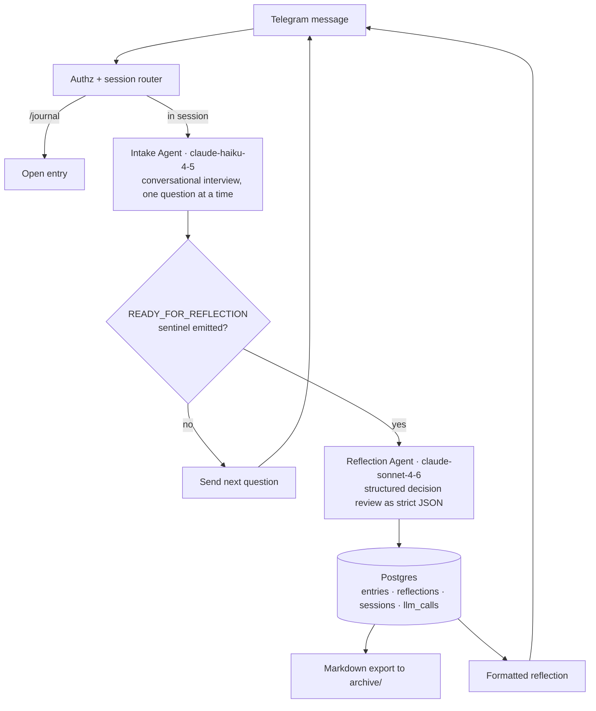
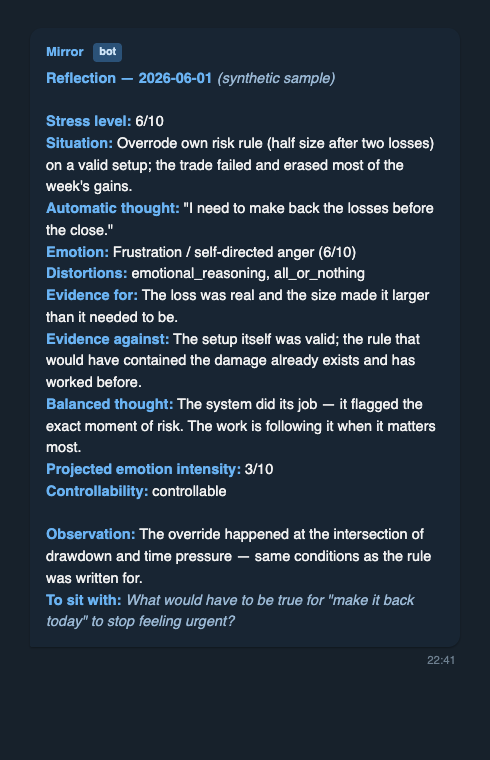

[](https://github.com/solidx86/mirror/actions/workflows/ci.yml)

# Mirror — AI Journaling Assistant

Mirror is a personal decision-journaling system I built for myself and use daily as a full-time trader. I journal by chatting with a Telegram bot: an **Intake Agent** (Claude Haiku) interviews me conversationally until it judges the entry complete, then hands off to a **Reflection Agent** (Claude Sonnet) that returns a structured decision review — assumptions surfaced, evidence weighed for and against, a calibrated reframe, and one question to sit with overnight (the format is a thought record, borrowed from CBT). It is deliberately anti-sycophantic: it challenges my reasoning rather than validating it. Everything persists to Postgres with an LLM-call audit log, plus a human-readable Markdown archive. The technically interesting parts: a two-model agent pipeline where the cheap model decides when the expensive one runs (via an in-band readiness sentinel), prompts treated as versioned product artifacts, and a deterministic test suite that validates the workflow graph, the prompt contracts, and the repo's privacy invariants on every push.



## What's inside

- **A 28-node n8n workflow** (`workflows/`) wiring Telegram trigger → session state machine → two LLM agents → persistence → export. The exported JSON is version-controlled as the audit trail; the test suite is its compile step.
- **Two agents on different model tiers**: intake on Haiku (many cheap conversational turns), reflection on Sonnet (one expensive structured pass). The intake prompt ends with an exact sentinel string the parser node gates on — the cheap model decides when the expensive model runs.
- **Prompts as product** (`prompts/`): a shared `_global` layer (philosophy + mandatory anti-sycophancy clauses) substituted into per-agent prompts, versioned as `_v1.md`/`_v2.md` files, never overwritten. The reflection prompt demands strict bare JSON with an enumerated cognitive-distortion vocabulary and a controllability axis that changes the agent's behavior (Stoic reframe vs. smallest-next-behavior).
- **A 4-table schema** (`scripts/schema.sql`): `entries`, `reflections`, `sessions` (a one-row-per-chat state machine), and `llm_calls` — an audit log that records model, tokens, and latency but *never* prompt content, by design.
- **A deterministic validator suite** (`tests/`, 28 tests, stdlib + pytest, no network or API keys): workflow-graph integrity (no dangling connections, no orphan nodes), SQL-injection conventions (every LLM-generated string reaches SQL only through an explicit escaping node), prompt contracts (sentinel shared between prompt and parser, schema fields the renderer reads), and a privacy denylist that fails the build if credentials or journal-content markers ever land in a tracked file.

## Sample output

A synthetic end-to-end example — intake conversation through structured reflection — is in [`examples/sample-entry.md`](examples/sample-entry.md). The reflection the bot sends back looks like this:



## Data files & provenance

| Path | What it is | Produced / consumed by | Real or synthetic |
|---|---|---|---|
| `prompts/*.md` | Agent system prompts (the product) | Authored by hand; hot-read by n8n on every run | Source code |
| `workflows/*.json` | n8n workflow export, credential-free | Exported from n8n UI; validated by `tests/` | Source code |
| `scripts/schema.sql` | Postgres schema | Runs once on first container init | Source code |
| `scripts/backup.sh` | Journal-data backup to a separate private repo | Run manually / scheduled | Source code |
| `examples/sample-entry.md` | Demo of the export format | Written by hand for this README | **Synthetic** |
| `docs/media/` | Screenshot of a sample reflection | Rendered from the synthetic sample | **Synthetic** |
| `env.template` | Config placeholders | Copied to gitignored `.env` | Placeholders only |
| `data/`, `n8n-data/`, `archive/`, `backups/`, `.env` | Live DB, n8n state, journal exports, dumps, secrets | The running system | **Real — gitignored, never tracked; enforced by `tests/test_privacy.py`** |

## Running it yourself

```bash
cp env.template .env        # add your Telegram bot token + Anthropic API key
docker compose up -d        # Postgres + n8n on localhost
# then: import workflows/*.json into n8n, attach credentials, activate
python3 -m venv .venv && .venv/bin/pip install pytest && .venv/bin/pytest
```

Full end-to-end runbook — Cloudflare Tunnel, n8n credentials, Telegram bot, first entry — is in [`docs/SETUP.md`](docs/SETUP.md).

**Stack:** n8n CE · Postgres 16 · Claude API (Haiku 4.5 + Sonnet 4.6 via raw HTTP, no framework) · Telegram Bot API (webhook via Cloudflare Tunnel) · Docker Compose · pytest + GitHub Actions.

## License & disclaimers

Source-available for portfolio review. **All rights reserved** — no license is granted for reuse or redistribution.

This is personal tooling, not a product or professional advice of any kind. The reflection format is adapted from CBT thought records, but the system is a journaling aid for decision review — not therapy, and not financial advice.
